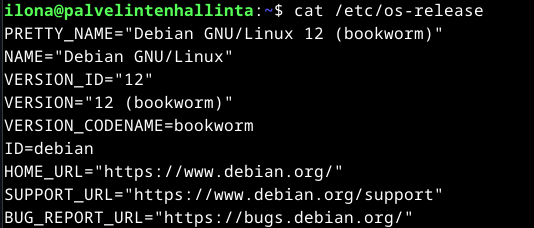
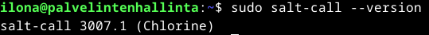
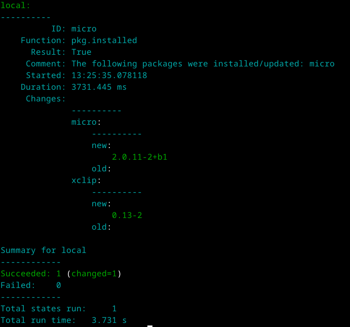
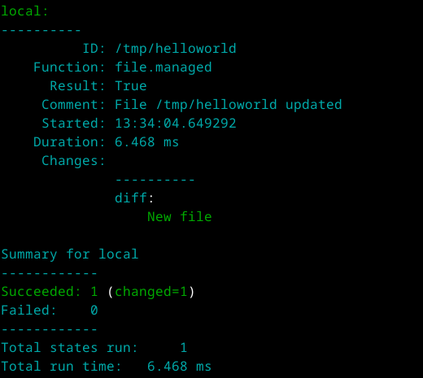
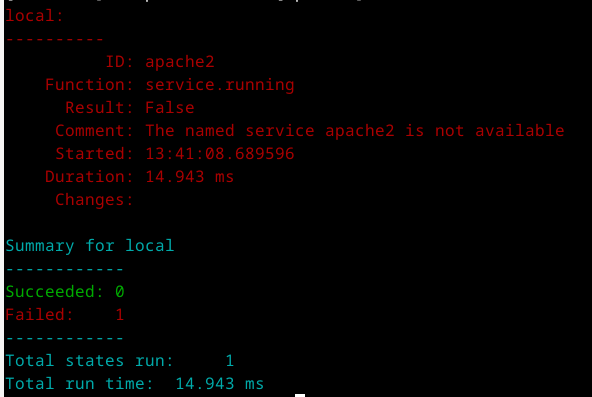
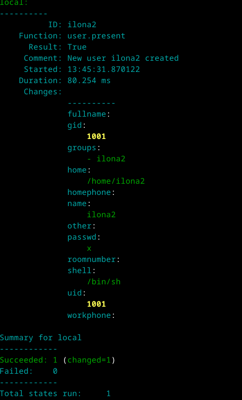
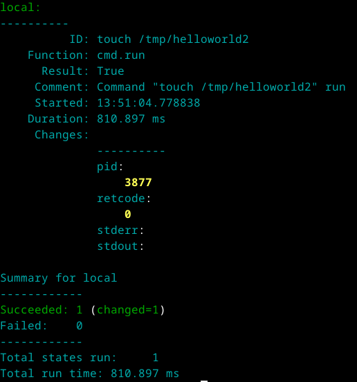
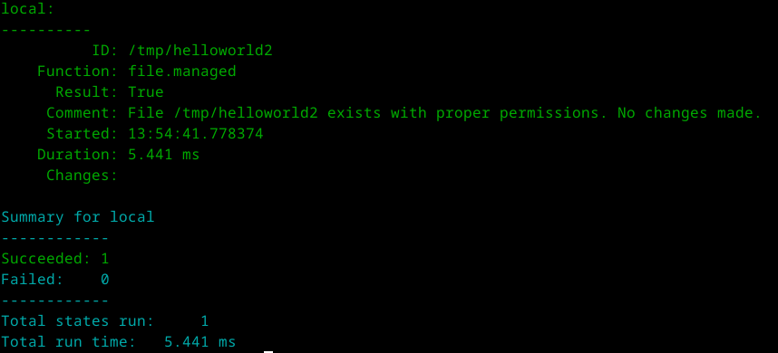
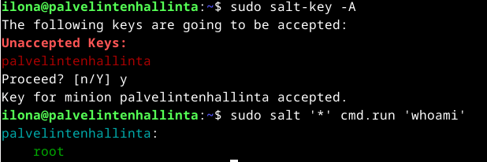

githubtesti

# H1 Viisikko

Tämän viikon tehtävissä tuli tiivistää kolme artikkelia sekä asentaa Debian 12 Bookworm-virtuaalikoneeseen. Tälle luodulle virtuaalikoneelle tuli asentaa Salt, josta tuli tutkia tilafunktioita, idempotenttia ja herra-orja arkkitehtuuria.

## Tiivistelmät 

### Run Salt Command Locally

- Saltin komentoja voidaan ajaa paikallisesti, ja ne ovat samat Linuxilla ja Windowsilla. Saltia usein käytetään hallinnoimaan orjatietokoneita verkon välityksellä.
- Pkg-komennolla asennetaan tai poistetaan ohjelmistoja.
- File-komennolla luodaan tai muokataan tiedostoja.
- Service-komennolla voidaan käynnistää tai sammuttaa demoneja.
- User-komennolla voidaan hallinnoida käyttäjiä.
- Cmd-komennolla voidaan ajaa komentoja.

(Karvinen 2023)

### Salt Quickstart – Salt Stack Master and Slave on Ubuntu Linux

- Saltissa riittää, että vain master on julkisessa verkossa ja sen osoite tiedetään. Orjat voivat olla missä tahansa esimerkiksi palomuurin takana.
- Jotta Salt toimii täytyy hallinnoivalle tietokoneelle asentaa salt-master ja orjatietokoneille salt-minion.
- Lopuksi vielä orjatietokoneen salasana täytyy hyväksyä herratietokoneella.
- Tämän jälkeen orjatietokoneita voi hallinoida herratietokoneelta käsin sudo salt-komennolla.

(Karvinen 2018)

### Raportin kirjoittaminen

- Raportin tulisi olla täsmällinen, ja sitä olisi hyvä kirjoittaa samalla kun tekee tehtäviä.
- Hyvä raportti on toistettava, täsmällinen, helppolukuinen ja lähteisiin on viitattu.
- Toistettavuus tarkoittaa sitä, että käyttöympäristö on raportoitu ja sen tuilsi johtaa samaan tulokseen toistettuna samassa ympäristössä.
- Täsmällisyys tarkoittaa sitä, että esimerkiksi kellonajat on raportoitu sekä toimenpiteet ja niiden tulokset on tarkasti kerrottu.
- Helppolukuisessa raportissa on väliotsikot ja kielioppiin on kiinnitetty huomiota.
- Virheitä raportoinnissa on toisten tekstien tai kuvien luvaton kopiointi sekä valehtelu.

(Karvinen 2006)

### Käyttöympäristö

Tietokone: Itse kasattu pöytätietokone

Emolevy: PRIME Z390-P

Prosessori: 3,70 GHz Intel Core i5-9600k

Keskusmuisti: 16 GB 3200MHz DDR4

Näytönohjain: Radeon RX 5600 XT Pulse 6GB GDDR6

Tallennustilat: C:/ 500 GB SSD M.2, D:/ 1000 GB SSD M.2

Käyttöjärjestelmä: Windows 11 Home 64-bit

## Tehtävät

Kello oli 12.15 kun aloitin tehtävät. 

### Debian 12-Bookworm asennus

Loin uuden virtuaalitietokoneen Virtualboxilla. Asetin sen nimeksi palvelintenhallinta, livelevykuvaksi Debian 12, annoin välimuistia 4000 MB sekä 4 prosessorinydintä ja viimeiseksi asetin kovalevyn kooksi 60GB. Tämän jälkeen käynnistin luomani virtuaalikoneen ja asensin siihen Debian 12-Bookwormin. Asennus valmistui 12.28.

Virtuaalikoneen käyttöympäristö tehtävässä oli siis seuraavanlainen: 

Keskusmuisti: 4 GB

Prosessoriytimet: 4

Massamuisti: 60 GB

Käyttöjärjestelmä: Debian 12 Bookworm (64-bit)

### Salt asennus

Asensin Saltin virtuaalikoneeseen seuraavilla komennolla:
`$ sudo mkdir -p /etc/apt/keyrings` - luodaan kansio keyrings /etc/apt/ hakemistoon
`$ sudo curl -fsSL -o /etc/apt/keyrings/salt-archive-keyring-2023.gpg https://repo.saltproject.io/salt/py3/debian/12/amd64/SALT-PROJECT-GPG-PUBKEY-2023.gpg` - lisätään keyrings-kansioon Saltin julkinen avain
`$ echo "deb [signed-by=/etc/apt/keyrings/salt-archive-keyring-2023.gpg arch=amd64] https://repo.saltproject.io/salt/py3/debian/12/amd64/latest bookworm main" | sudo tee /etc/apt/sources.list.d/salt.list` - lisätään Salt Debianin paketteihin julkisen avaimen kanssa

Tämän jälkeen asensin salt-minionin komennolla `$ sudo apt-get -y install salt-minion`. Tämän jälkeen vielä tarkistin että Salt on asentunut.

Kuten kuvassa näkyy Salt oli asentunut, ja sen versio oli 3007.1. Tämä tehtävä valmistui 13:10.

(Karvinen 2024)

### Esimerkit komennoista

#### Pkg

Ajoin komennon `$ sudo salt-call --local -l info state.single pkg.installed micro`. 

Kuvasta voidaan havaita, että komento asensi minulle Micro-tekstieditorin. Pkg-komennolla voidaan siis hallinnoida ohjelmia, ja vastaavasti voisin poistaa ohjelman vaihtamalla pgk.installed-komennon pkg.removed-komennoksi. 

#### File

Ajoin komennon `$ sudo salt-call --local -l info state.single file.managed /tmp/helloworld  contents="Hello world!"`.

Komennolla loin tmp-hakemistoon uuden tiedoston helloworld, jonka sisällöksi tuli teksti Hello world!. Tarkistin vielä oliko tiedosto ilmestynyt.

Lopuksi vielä poistin tiedoston komennolla `$ sudo salt-call --local -l info state.single file.absent /tmp/helloworld`.

#### Service

Seuraavaksi kokeilin käynnistää Apachea komennolla `$ sudo salt-call --local -l info state.single service.running apache2 enable=True`. Tämä palautti oletetusti epäonnistuneen tuloksen, sillä en ole asentanut Apachea virtuaalikoneeseen.

Jos minulla olisi Apache, tämä komento olisi käynnistänyt sen. Vastaavasti taas olisin voinut sammuttaa Apachen komennolla service.dead.

#### User

Kokeilin uuden käyttäjän luomista komennolla `$ sudo salt-call --local -l info state.single user.present ilona2`. Koska kyseistä käyttäjää ei ollut olemassa, loi se uuden käyttäjän. 

Lopuksi poistin turhan käyttäjän komennolla `$ sudo salt-call --local -l info state.single user.absent ilona2`.

#### Cmd

Asetin komennoksi `$ sudo salt-call --local -l info state.single cmd.run 'touch /tmp/helloworld2' creates="/tmp/helloworld2"`. Cmd-komento ajaa siis Linuxin touch-komennon. 

Tässä tapauksessa se siis loi tmp-hakemistoon helloworld2-tiedoston.

(Karvinen 2023)

### Idempotentti

Idempotenttia testatakseni ajoin komennon `$ sudo salt-call --local -l info state.single file.managed /tmp/helloworld2`.

Koska olin edellisessä tehtävässä luonut helloworld2-tiedoston kyseiseen kansioon, mitään ei tapahtunut. Idempotentti tarkoittaa siis, että komento kertoo että kyseinen tiedosto on oltava olemassa, ei sitä että se tulisi välttämättä luoda. Tämän takia mitään ei siis suoritettu, koska kyseinen tiedosto oli jo olemassa. Tehtävä oli valmis 13:55.

(Karvinen 2024)

### Herra-orja arkkitehtuuri

Koska olin jo aiemmin asentanut minionin, tuli minun enää asentaa master. Aloitin pakettilistan päivittämisellä `$ sudo apt-get update` ja salt-masterin asentamisella `$ sudo apt-get -y install salt-master`. Tämän jälkeen editoin minionin asetustiedostoa komennolla `$ sudoedit /etc/salt/minion` ja asetin masteriksi localhostin. Käynnistin minion-demonin uudestaan komennolla `$ sudo systemctl restart salt-minion.service`. Lopuksi vielä hyväksyin minionin avaimen komennolla `$ sudo salt-key -A`. Testasin vielä toimiiko master-minion yhteys komennolla `$ sudo salt '*' cmd.run 'whoami'`.

Komento palautti tietokoneen nimen, joten päättelin siis, että master-minion arkkitehtuuri oli onnistunut. Tehtävä valmistui 14:15.

(Karvinen 2023)

## Lähteet

Karvinen, T. 2024. Palvelinten Hallinta. Tero Karvisen verkkosivusto. Luettavissa: [https://terokarvinen.com/palvelinten-hallinta/](https://terokarvinen.com/palvelinten-hallinta/). Luettu 30.10.2024.

Karvinen, T. 2023. Run Salt Command Locally. Tero Karvisen verkkosivusto. Luettavissa: [https://terokarvinen.com/2021/salt-run-command-locally/](https://terokarvinen.com/2021/salt-run-command-locally/). Luettu 30.10.2024.

Karvinen, T. 2018. Salt Quickstart – Salt Stack Master and Slave on Ubuntu Linux. Tero Karvisen verkkosivusto. Luettavissa: [https://terokarvinen.com/2018/03/28/salt-quickstart-salt-stack-master-and-slave-on-ubuntu-linux/](https://terokarvinen.com/2018/03/28/salt-quickstart-salt-stack-master-and-slave-on-ubuntu-linux/). Luettu: 30.10.2024.

Karvinen, T. 2006. Raportin kirjoittaminen. Tero Karvisen verkkosivusto. Luettavissa: [https://terokarvinen.com/2006/06/04/raportin-kirjoittaminen-4/](https://terokarvinen.com/2006/06/04/raportin-kirjoittaminen-4/). Luettu: 30.10.2024.
