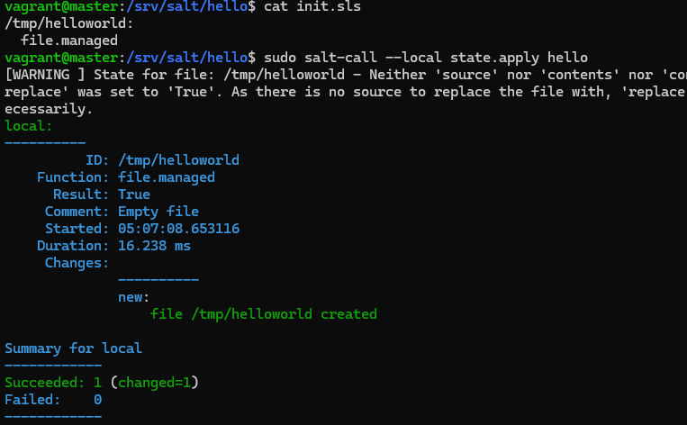
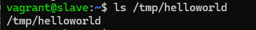
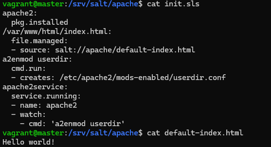
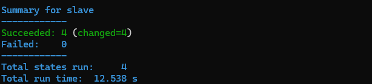
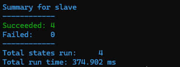
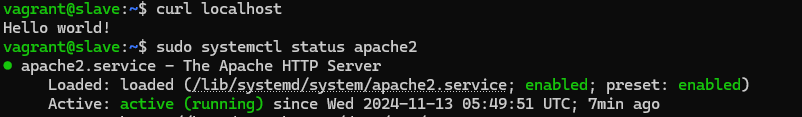
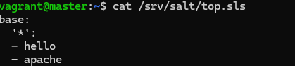
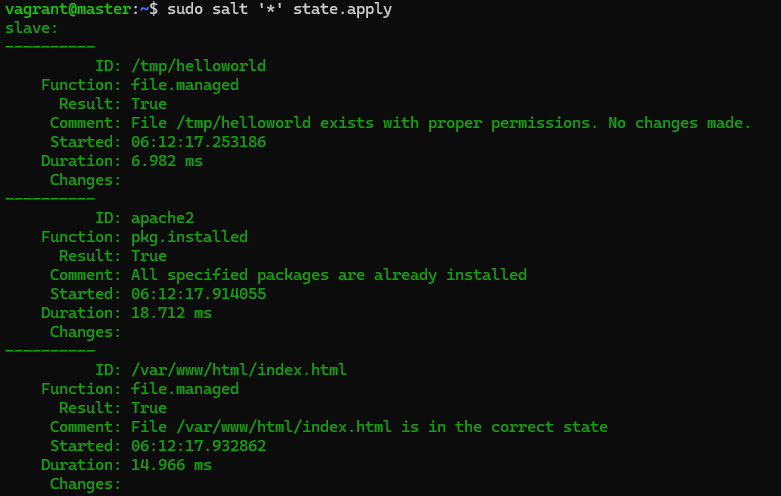
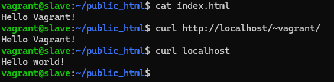

# H2 Infra-as-code

Tämän viikon tehtävissä tuli tiivistää viisi artikkelia sekä tehdä Vagrantilla kahden Linux-koneen verkko. Verkossa tuli toteuttaa Saltilla herra-orja arkkitehtuuri ja tehdä sls-tiedostoja, joita pystyy ajamaan verkon yli orjalla.

## Tiivistelmät

### Two Machine Virtual Network With Debian 11 Bullseye and Vagrant

- Vagrantin käyttöön pitää asentaa itse Vagrant sekä Virtualbox.
- Jos haluaa käyttää useampaa virtuaalitietokonetta Vagrantissa, tulee luoda Vagrantfile, johon määritellään luotavat virtuaalitietokoneet.
- Virtuaalikoneet voi luoda komennolla `$ vagrant up`, poistaa komennolla `$ vagrant destroy` ja haluttuun virtuaalikoneeseen voidaan kirjautua komennolla `$ vagrant ssh {virtuaalikoneen nimi}`

(Karvinen 2021)

### Salt Quickstart – Salt Stack Master and Slave on Ubuntu Linux

- Saltissa riittää, että vain master on julkisessa verkossa ja sen osoite tiedetään. Orjat voivat olla missä tahansa esimerkiksi palomuurin takana.
- Jotta Salt toimii täytyy hallinnoivalle tietokoneelle asentaa salt-master ja orjatietokoneille salt-minion.
- Lopuksi vielä orjatietokoneen salasana täytyy hyväksyä herratietokoneella.
- Tämän jälkeen orjatietokoneita voi hallinoida herratietokoneelta käsin sudo salt-komennolla.

(Karvinen 2018)

### Hello Salt Infra-as-Code

- Moduuleita voi tehdä /srv/salt kansioon, joka on jaettu kaikille orjatietokoneille. Eri moduuleille kannattaa tehdä omat kansiot.
- Moduulin sisään voi lisätä sls-tiedostoja Salt-kielellä sekä lisätä muita tarvittavia tiedostoja ja malleja.
- Tehtyjä moduuleita voi toistaa paikallisesti komennolla `$ sudo salt-call --local state.apply {moduulin nimi}`, jolloin sls-tiedostoihin kirjoitettu Salt-koodi ajetaan.

(Karvinen 2014)

### Salt Vagrant - automatically provision one master and two slaves

- Moduuleita voi toistaa kaikilla orjatietokoneilla komennolla `$ sudo salt '*' state.apply {moduulin nimi}`.
- Halutut moduulit halutuille ryhmille voidaan tallentaa top.sls-tiedostoon /srv/salt kansion alle, jolloin ne toistetaan automaattisesti ilman, että moduulin nimeä tarvii erikseen kertoa. Tällöin komennoksi riittää `$ sudo salt '*' state.apply`.

(Karvinen 2023)

### Salt overview

- Salt käyttää YAML-kieltä.
- YAML-kielessä data varastoidaan avain-arvo pareina ja avain erotetaan arvosta kaksoispisteellä. Isoilla ja pienillä kirjaimilla on merkitystä.
- Tabin käyttö ei ole sallittua, vaan esimerkiksi ominaisuudet tai listat tulee sisentää välilyönneillä. Lohkojen vakiosisennyksenä käytetään tyypillisesti kahta välilyöntiä.
- Kommentit alkavat #-merkillä.

(Salt contributors s.a.)

## Tehtävät 

Kello oli 5:03 kun aloitin tehtävät.

### a) Hello Vagrant

Minulla oli Virtualbox ja Vagrant jo valmiiksi asennettuna. Osoitin seuraavalla komennolla, että Vagrant on asennettu:

Komento palautti, että minulla oli asennettuna Vagrantin versio 2.4.1. Tehtävä oli valmis 5:05.

### b) Linux Vagrant

Tein virtuaalikoneille kansion palvelintenhallinta Windows-tietokoneeseeni. Avasin kansion komentokehotteessa ja alustin Vagrant-tiedoston Debian-virtuaalikoneen luontiin komennolla:

    vagrant init debian/bookworm64

Tämän jälkeen loin virtuaalikoneen komennolla ja loin yhteyden virtuaalikoneeseen:

    vagrant up
    vagrant ssh

Tämän jälkeen huomasin olevani Vagrantin luomassa Debian Bookworm-virtuaalikoneessa. Poistuin virtuaalikoneelta ja tuhosin lopuksi luomani virtuaalikoneen:

    exit
    vagrant destroy

Tehtävä oli valmis 5:10.

### c) Kaksin kaunihimpi

Aloitin tehtävän muokkaamalla viime tehtävässä luotua Vagrantfileä soveltaen [näitä ohjeita](https://terokarvinen.com/2021/two-machine-virtual-network-with-debian-11-bullseye-and-vagrant/).

Muokkasin Vagrantifileä kuvan mukaisesti, eli nyt `vagrant up`-komennon pitäisi luoda master- ja slave-virtuaalikoneet. Seuraavaksi loin virtuaalikoneet, kirjauduin niille sekä kokeilin pingata niillä toisiaan alemman kuvan mukaisesti.

Pingaus näytti onnistuvan, joten tehtävä valmistui 5:40.

### d) Herra-orja verkossa

Aloitin tehtävän kirjautumalla master-virtuaalikoneelleni. Yritin asentaa Saltin [viime tehtävästä](https://github.com/ilohil/servermanagement-course2024/blob/main/h1_viisikko.md#salt-asennus) tutulla tavalla, mutta huomasin ettei asennuksen verkko-osoite toiminut. Tutkailin asiaa [Salt:in asennusohjeista](https://docs.saltproject.io/salt/install-guide/en/latest/topics/install-by-operating-system/linux-deb.html), ja huomasinkin että Saltin asennusohjeet ja verkko-osoite on muuttunut sitten viimeviikon. Asensin Saltin seuraavilla komennoilla:

    $ mkdir -p /etc/apt/keyrings
    $ curl -fsSL https://packages.broadcom.com/artifactory/api/security/keypair/SaltProjectKey/public | sudo tee /etc/apt/keyrings/salt-archive-keyring.pgp
    $ curl -fsSL https://github.com/saltstack/salt-install-guide/releases/latest/download/salt.sources | sudo tee /etc/apt/sources.list.d/salt.sources
    $ sudo apt-get update
    $ sudo apt-get -y dist-upgrade

Tämän jälkeen asensin master-virtuaalikoneelle Salt-masterin:

    $ sudo apt-get -y install salt-master

Tämän jälkeen kirjauduin slave-virtuaalikoneelleni ja asensin saltin samoilla ohjeilla. Tämän jälkeen asensin Salt-minionin:

    $ sudo apt-get -y install salt-minion

Tämän jälkeen muokkasin /etc/salt/minion-tiedostoa ja asetin slave-virtuaalikoneen masteriksi master-virtuaalikoneeni IP-osoitteen. Tämän jälkeen vielä käynnistin Salt-Minionin uudestaan:

    $ sudo systemctl restart salt-minion.service

Seuraavaksi kirjauduin slave-virtuaalikoneelta ulos ja siirryin takaisin master-virtuaalikoneelleni. Hyväksyin slave-virtuaalikoneen avaimen ja kokeilin minionin toimintaa.

Kuten kuvasta näkyy slave-virtuaalikone vastasi master-virtuaalikoneen komentoon. Tehtävä oli valmis 6:50.

### e) Hei infrakoodi!

Aloitin tehtävällä luomalla Master-virtuaalikoneelle moduulin hello:

    $ sudo mkdir -p /srv/salt/hello/

Tämän jälkeen siirryin luomaani kansioon, ja loin init.sls-tiedoston. 

Loin sls-tiedostoon yksinkertaisen komennon joka luo helloworld-tiedoston kuvan mukaisesti. Tämän jälkeen testasin komentoa paikallisesti, ja vastauksena sain, että helloworld tiedosto tulisi olla luotu. Tarkistin vielä, että tiedosto oli luotu komennolla: 

    $ ls /tmp/helloworld

Tiedosto näkyi /tmp/-hakemistossa, joten tehtävä oli onnistunut. Tehtävä valmistui 7:11.

### f) Tiedoston ajo orjalla

Ajoin edellisessä tehtävässä luodun sls-tiedoston slave-virtuaalikoneella komennolla:

    $ sudo salt '*' state.apply hello

Konsoli palautti, että uusi tiedosto luotiin. Tarkistin asian vielä kirjautumalla slave-virtuaalikoneelle ja tutkimalla /tmp/-hakemistoa.

Kuvan mukaisesti slave-virtuaalikoneen /tmp/-hakemistoon oli luotu helloworld-tiedosto. Tehtävä valmistui 7:21.

### g) Sls-tiedosto

Aloitin tehtävällä luomalla apache-nimisen moduulin /srv/salt/-hakemistoon. Tämän jälkeen loin moduulille init.sls-tiedoston ja default-index.html-tiedoston [näiden ohjeiden](https://terokarvinen.com/2018/apache-user-homepages-automatically-salt-package-file-service-example/?fromSearch=apache) mukaisesti.

Tämän jälkeen ajoin moduulin komennolla: 

    $ sudo salt '*' state.apply apache

Ensimmäisessä ajossa meni pitkään, sillä komento asensi Apachen.

Seuraavissa ajoissa ei tehty asennuksia tai muutakaan muutoksia, joten ajo oli huomattavasti nopeampi. 

Koska muutoksia ei tapahtunut, oli moduuli idempotentti. Tarkistin tulokset vielä kirjautumalla slave-virtuaalikoneelle ja kokeilin Apachen toimintaa sekä curlia localhostiin. 

Slave-virtuaalikoneen etusivuksi oli vaihtunut Hello world! sekä Apache oli päällä, joten moduuli toimi toivotusti. Tehtävä oli valmis 8:00.

### h) Top file

Kirjauduin master-virtuaalikoneelleni. Loin top.sls-tiedoston /srv/salt/-hakemistoon. 

Kirjoitin tiedoston sisällön kuvan mukaisesti, eli sen pitäisi ajaa hello- sekä apache-moduulit. Kokeilin moduulien ajamista orjalla:

Komento ajoi ensin hello-moduulin ja tämän jälkeen apache-moduulin, eli top.sls-tiedosto toimi odotetusti. Tehtävä oli valmis 8:14.

### i) Apache-bonustehtävä

Loin jo ylemmissä tehtävissä Apache-moduulin ja näytin, että se palautti slave-tietokoneen osoitteesta hello world-weppisivun. Käytin tähän tehtävään [näitä ohjeita](https://terokarvinen.com/2018/apache-user-homepages-automatically-salt-package-file-service-example/?fromSearch=apache). Jäljellä oli siis kokeilla muokata etusivun sisältöä käyttäjän oikeuksin. Kirjauduin slave-virtuaalikoneelleni ja loin käyttäjän hakemistoon public_html-kansion, johon loin index.html-tiedoston kuvan mukaisesti. Tämän jälkeen kokeilin sivun näkymistä curl-komennolla.

En saanut käyttäjän muokkaamaa sivua näkymään suoraan localhost-osoitteessa, vaan se palautti aluksi asettamani hello world-sivun. Huomasin kuitenkin, että käyttäjän luoma sivu näkyi osoitteessa http://localhost/~vagrant/. Päätin, että bonustehtävän lopputulos oli riittävä itselleni ja tehtävä valmistui 8:31.

## Lähteet

Karvinen, T. 2018. Apache User Homepages Automatically – Salt Package-File-Service Example. [https://terokarvinen.com/2018/apache-user-homepages-automatically-salt-package-file-service-example/?fromSearch=apache](https://terokarvinen.com/2018/apache-user-homepages-automatically-salt-package-file-service-example/?fromSearch=apache). Luettu: 13.11.2024.

Karvinen, T. 2014. Hello Salt Infra-as-Code. Tero Karvisen verkkosivusto. Luettavissa [https://terokarvinen.com/2024/hello-salt-infra-as-code/](https://terokarvinen.com/2024/hello-salt-infra-as-code/). Luettu: 11.11.2024.

Karvinen, T. 2018. Salt Quickstart – Salt Stack Master and Slave on Ubuntu Linux. Tero Karvisen verkkosivusto. Luettavissa: [https://terokarvinen.com/2018/03/28/salt-quickstart-salt-stack-master-and-slave-on-ubuntu-linux/](https://terokarvinen.com/2018/03/28/salt-quickstart-salt-stack-master-and-slave-on-ubuntu-linux/). Luettu: 11.11.2024.

Karvinen, T. 2023. Salt Vagrant - automatically provision one master and two slaves. Tero Karvisen verkkosivusto.  Luettavissa: [https://terokarvinen.com/2023/salt-vagrant/#infra-as-code---your-wishes-as-a-text-file](https://terokarvinen.com/2023/salt-vagrant/#infra-as-code---your-wishes-as-a-text-file). Luettu: 11.11.2024.

Karvinen, T. 2021. Two Machine Virtual Network With Debian 11 Bullseye and Vagrant. Tero Karvisen verkkosivusto. Luettavissa: [https://terokarvinen.com/2021/two-machine-virtual-network-with-debian-11-bullseye-and-vagrant/](https://terokarvinen.com/2021/two-machine-virtual-network-with-debian-11-bullseye-and-vagrant/). Luettu: 11.11.2024.

Salt Contributors. s.a. Install Salt DEBs. Salt install guide. Luettavissa: [https://docs.saltproject.io/salt/install-guide/en/latest/topics/install-by-operating-system/linux-deb.html](https://docs.saltproject.io/salt/install-guide/en/latest/topics/install-by-operating-system/linux-deb.html). Luettu: 13.11.2024.

Salt Contributors. s.a. Salt overview. Salt user guide. Luettavissa: [https://docs.saltproject.io/salt/user-guide/en/latest/topics/overview.html#](https://docs.saltproject.io/salt/user-guide/en/latest/topics/overview.html#). Luettu: 13.11.2024.
