# H2 Demoni

## Tiivistelmät

### Pkg-File-Service – Control Daemons with Salt – Change SSH Server Port

- Tyypillisesti tiedostonhallintajärjestelmän konfigurointi menee seuraavasti; asennetaan ohjelma, ylikirjoitetaan konfiguraatiotiedosto ja käynnistetään demoni uudelleen.
- SSH-moduulissa asennetaan ensin openssh-server pkg.installed-komennolla, sitten muokataan tiedostoa /etc/ssh/sshd_config ja käynnistetään SSH uudelleen.
- Moduulin voi ajaa kaikilla orjilla komennolla `$ sudo salt '*' state.apply sshd`.
- Moduulin toimintaa voi testata komennolla `$ nc -vz {osoite} {portin numero}` tai `$ ssh -p {portin numero} {käyttäjä}@{osoite}`

(Karvinen 2018)

### Saltin tilaohjeet

- Saltilla ohjelmia voi asentaa komennolla pkg.installed. Ohjelmia voi poistaa komennolla pkg.purged. Useampaan ohjelmaan voi viitata komennolla pkgs.
- Tiedostoja voi hallita komennolla file.managed, jolloin tiedosto ylikirjoitetaan jos se on jo olemassa. Tiedostoille voi myös antaa  parametreiksi esimerkiksi tiedoston ommistajan. File.absent komennolla voi poistaa tiedostoja. File.symlink komennolla voi luoda symbolisen linkin, joka viittaa toiseen tiedostoon tai kansioon.
- Service.running komennolla voi käynnistää demoneja, ja enable-parametrilla ne voidaan asettaa käynnistymään tietokoneen käynnistyessä. Service.dead komennolla voidaan sammuttaa demoneja.

(Salt project s.a.)

## Tehtävät

Aloitin tehtävät 22:24. 

### a) Apache easy mode

Tässä tehtävässä tuli asentaa Apache ja korvata sen testisivu ensin manuaalisesti ja sitten Salt-moduulilla. Kirjauduin Master-nimiselle Debianvirtuaalikoneelle. Käytin tehtävässä [näitä ohjeita](https://terokarvinen.com/2018/04/10/name-based-virtual-hosts-on-apache-multiple-websites-to-single-ip-address/?fromSearch=apache) Asensin Apachen ensiksi manuaalisesti:

    $ sudo apt-get update
    $ sudo apt-get -y dist-upgrade
    $ sudo apt-get -y install apache2

Tämän jälkeen muokkasin Apachen oletussivua: 

    $ echo "Hello world!"|sudo tee /var/www/html/index.html
    $ sudo systemctl restart apache2

Tämän jälkeen tarkistin, että Apache on käynnissä ja localhostissa näkyy Apachen testisivulla muokkaamani tiedosto.

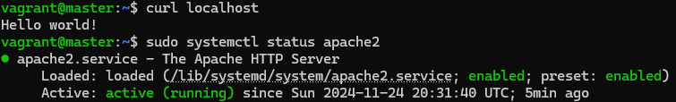

Apache oli käynnissä ja testisivu oli vaihtunut, joten manuaalinen asennus oli onnistunut. Tämän jälkeen poistin Apachen. Seuraavaksi aloitin Apache moduulin luomisen luomalla kansion:

    $ sudo mkdir -p /srv/salt/apache/

Tämän jälkeen loin init.sls-tiedoston Apache-moduuliin:

    apache2:
      pkg.installed
    
    /var/www/html/index.html:
      file.managed:
      - contents: "Hello world!"
    
    apache2service:
      service.running:
      - name: apache2

Tämnän jälkeen kokeilin ajaa tekemäni moduulin paikallisesti: 

    $ sudo salt-call --local state.apply apache

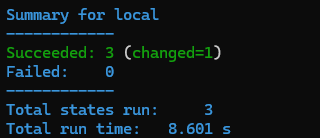

Moduulin ajo meni läpi, joten kokeilin ajaa moduulin vielä toisen kerran:

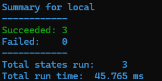

Muutoksia ei tapahtunut joten moduuli oli idempotentti. Tarkistin vielä että Apache oli käynnissä ja testisivu oli vaihtunut.

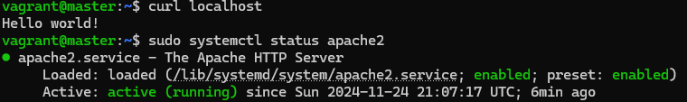

Myös tällä kertaa Apache oli käynnissä ja testisivu oli vaihtunut. Tehtävä oli valmis 23:16.

### b) SSHouto

Tässä tehtävässä tuli lisätä uusi portti, jota SSH kuuntelee. Aloitin tehtävän 23:18. Käytin tässä tehtävässä [näitä ohjeita](https://terokarvinen.com/2018/pkg-file-service-control-daemons-with-salt-change-ssh-server-port/?fromSearch=ssh). Aloitin asentamalla SSH:n manuaalisesti:

    $ sudo apt install openssh-server

Tämän jälkeen lisäsin portin 1234 SSH-asetustiedostoon ja käynnistin SSH-serverin uudelleen: 

    $ sudoedit /etc/ssh/sshd_config
    $ sudo systemctl restart sshd

Tämän jälkeen tarkistin, että portti 1234 on avoinna ja SSH-server on käynnissä.

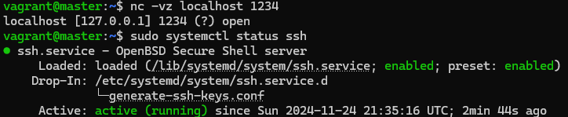

Portti oli avoinna ja SSH-käynnissä, joten manuaalinen asennus oli onnistunut. Tämän jälkeen poistin SSH-serverin ja aloitin moduulin luomisen luomalla sshd-kansion:

    $ sudo mkdir -p /srv/salt/sshd/

Tämän jälkeen loin init.sls-tiedoston sshd-moduuliin:

    openssh-server:
      pkg.installed
    
    /etc/ssh/sshd_config:
      file.managed:
      - source: salt://sshd/sshd_config
    
    sshd:
      service.running:
      - watch:
        - file: /etc/ssh/sshd_config

Ja loin myös sshd-configin sshd-moduuliin:

    Include /etc/ssh/sshd_config.d/*.conf
    Port 22
    Port 1234
    PasswordAuthentication no
    KbdInteractiveAuthentication no
    UsePAM yes
    PrintMotd no
    AcceptEnv LANG LC_*
    Subsystem    sftp    /usr/lib/openssh/sftp-server
    ClientAliveInterval 120
    UseDNS no

Tämän jälkeen kokeilin ajaa moduulin paikallisesti:

    $ sudo salt-call --local state.apply sshd

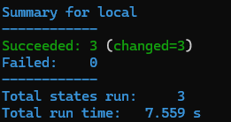

Moduulin ajo onnistui. Kokeilin vielä ajaa moduulin uudestaan varmistaakseni, että se on idempotentti.

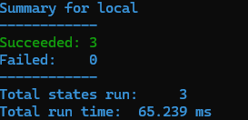

Muutoksia ei tapahtunut, joten moduuli oli idempotentti. Lopuksi vielä tarkistin, että SSH-server on käynnissä ja portti 1234 on auki.

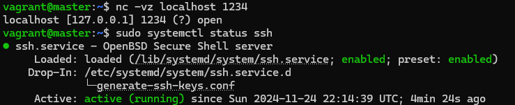

Kuvan mukaisesti portti 1234 oli auki ja SSH-serveri käynnissä, ja täten moduuli toimi toivotusti. Kello oli 00:21, kun sain tehtävän päätökseen.

### c) Oma moduli

Tässä tehtävässä tuli kertoa omasta moduulistaan, joka on myös kurssin lopputyö. Tällä hetkellä minulla on suunnitelmissa tehdä watchlist-tyyppinen tietokanta sarjoille ja elokuville. Tietokanta itsessään on melko simppeli, ja sisältää vain elokuvia tai sarjoja, arvosteluja ja tiedon siitä onko se katsottu vai katsomatta. Aion kuitenkin toteuttaa tietokannan hallinnan moduuleilla alusta loppuun. En osaa vielä tarkalleen sanoa mitä moduuleja tarvitsen tietokannan hallintaan, mutta luulen, että asia selviää sitten kun lähden tekemään tehtävää.

### d) VirtualHost

Tässä tehtävässä tuli asettaa Apache tarjoamaan weppisivua localhostissa, niin, että käyttäjä voi muokata tiedostoa kotihakemistossaan. Aloitin tehtävä 00:31. Käytin tässä tehtävässä [näitä ohjeita](https://terokarvinen.com/2018/apache-user-homepages-automatically-salt-package-file-service-example/?fromSearch=apache). Kokeilin tehtävää ensin manuaalisesti. Ensimmäisenä otin Apachen nykyisen testisivun pois käytöstä:

    $ sudo a2dissite 000-default.conf

Tämän jälkeen loin uuden Apache-asetustiedoston:

    $ sudoedit /etc/apache2/sites-available/homepage.conf

Johon asetin seuraavat  tiedot:

    <VirtualHost *:80>
     DocumentRoot /home/vagrant/public_html/
     <Directory /home/vagrant/public_html/>
       Require all granted
     </Directory>
    </VirtualHost>

Tämän jälkeen loin vielä kansion johon Apachen asetustiedosto viittaa ja loin sen sisälle yksinkertaisen index.html-tiedoston:

    $ mkdir public_html/
    $ cd public_html/
    $ nano index.html

Tämän jälkeen asetin homepage.conf-asetuksen käyttöön ja käynnistin Apachen uudelleen:

    $ sudo a2ensite homepage.conf
    $ sudo systemctl restart apache2

Tämän jälkeen testasin sivun näkyvyyttä localhostissa.

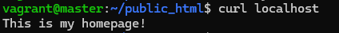

Kotisivu näkyi toivotusti, joten poistin taas Apachen ja muut tiedostot jota loin Apachea varten. Aloitin moduulin teon muokkaamalla Apache-moduulia. Aloitin tehtävän muokkaamalla init.sls-tiedostoa seuraavanlaiseksi:

    apache2:
      pkg.installed
    
    /home/vagrant/public_html:
      file.directory:
      - user: vagrant
      - group: vagrant
    
    /home/vagrant/public_html/index.html:
      file.managed:
      - contents: "This is my homepage!"
      - user: vagrant
      - group: vagrant
    
    a2dissite 000-default:
      cmd.run
    
    /etc/apache2/sites-available/homepage.conf:
      file.managed:
      - source: salt://apache/homepage.conf
    
    a2ensite homepage:
      cmd.run
    
    apache2service:
      service.running:
      - name: apache2
      - watch:
        - file: /etc/apache2/sites-available/homepage.conf
         - cmd: a2ensite homepage

Tämän jälkeen loin Apache-moduuliin homepage.conf-tiedoston, joka oli samanlainen kun aiemmassa manuaalisessa harjoituksessa. Tämän jälkeen ajoin moduulin paikallisesti:

    $ sudo salt-call --local state.apply apache

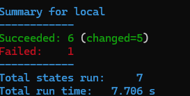

Ensimmäisellä kerralla ajosta tuli virhe. Huomasin kuitenkin heti, että olin tehnyt kirjoitusvirheen joka aiheutti ongelman. Korjattuani kirjoitusvirheen kokeilin ajaa moduulia muutaman kerran uudelleen.

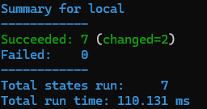

Huomasin, että vaikka muutoksia ei tulisi tapahtua ajettiin a2ensite ja a2dissite aina uudelleen, eli moduuli ei ollut idempotentti. En keksinyt itse ongelmaan ratkaisua joten chatGPT:n ehdottamana muokkasin cmd-komentoja seuraavanlaiseksi:

    a2dissite 000-default:
      cmd.run:
      - unless: test ! -L /etc/apache2/sites-enabled/000-default.conf
    
    a2ensite homepage:
      cmd.run:
      - unless: test -L /etc/apache2/sites-enabled/homepage.conf

Tämän jälkeen ajoin taas moduulin paikallisesti.

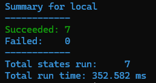

Tällä kertaa muutoksia ei enään tapahtunut, joten nyt moduuli oli vihdoin idempotentti. Kokeilin curlia localhostiin sekä Apachen toimintaa:

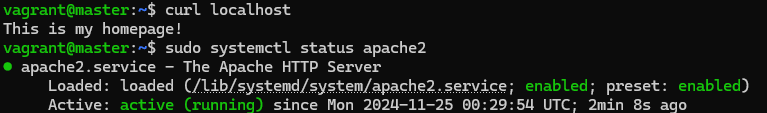

Tämän jälkeen vielä kokeilin muokata index.html-tiedostoa ilman sudoa. 

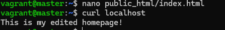
    
Käyttäjä pystyi muokkaamaan kotisivua omassa hakemistossaan ja kotisivun näkymä vaihtui localhostissa, eli moduuli toimi odotetusti. Kello oli 1:55 kun sain tehtävät valmiiksi.

# Lähteet

Karvinen, T. 2018. Apache User Homepages Automatically – Salt Package-File-Service Example. Tero Karvisen verkkosivusto. Luettavissa: [https://terokarvinen.com/2018/apache-user-homepages-automatically-salt-package-file-service-example/?fromSearch=apache](https://terokarvinen.com/2018/apache-user-homepages-automatically-salt-package-file-service-example/?fromSearch=apache). Luettu: 25.11.2024.

Karvinen, T. 2018. Name Based Virtual Hosts on Apache – Multiple Websites to Single IP Address. Tero Karvisen verkkosivusto. Luettavissa: [https://terokarvinen.com/2018/04/10/name-based-virtual-hosts-on-apache-multiple-websites-to-single-ip-address/?fromSearch=apache](https://terokarvinen.com/2018/04/10/name-based-virtual-hosts-on-apache-multiple-websites-to-single-ip-address/?fromSearch=apache). Luettu: 24.11.2024.

Karvinen, T. 2018. Pkg-File-Service – Control Daemons with Salt – Change SSH Server Port. Tero Karvisen verkkosivusto. Luettavissa: [https://terokarvinen.com/2018/pkg-file-service-control-daemons-with-salt-change-ssh-server-port/?fromSearch=ssh](https://terokarvinen.com/2018/pkg-file-service-control-daemons-with-salt-change-ssh-server-port/?fromSearch=ssh). Luettu: 24.11.2024.

Salt Project. s.a. salt.states.file. Salt project. Luettavissa: [https://docs.saltproject.io/en/latest/ref/states/all/salt.states.pkg.html](https://docs.saltproject.io/en/latest/ref/states/all/salt.states.file.html) Luettu: 25.11.2024.

Salt Project. s.a. salt.states.pkg. Salt project. Luettavissa: [https://docs.saltproject.io/en/latest/ref/states/all/salt.states.pkg.html](https://docs.saltproject.io/en/latest/ref/states/all/salt.states.pkg.html) Luettu: 25.11.2024.

Salt Project. s.a. salt.states.service. Salt project. Luettavissa: [https://docs.saltproject.io/en/latest/ref/states/all/salt.states.service.html](https://docs.saltproject.io/en/latest/ref/states/all/salt.states.service.html) Luettu: 25.11.2024.

