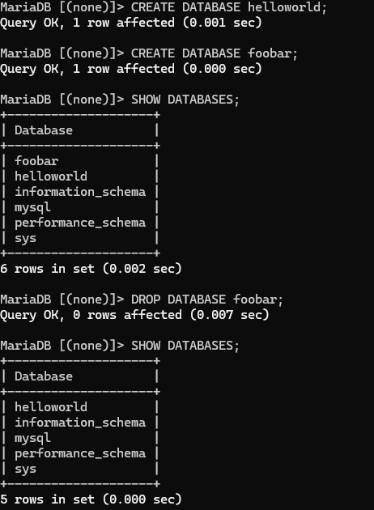

# H4 Puolikas

Tämän viikon tehtävissä tuli lähteä työstämään omaa Salt-moduulia. Olin valinnut aiheekseni tietokannan hallinnan moduuleilla. Tietokantaan on tarkoitus tallentaa suosikkisarjoja sekä -elokuvia. Lähdin suorittamaan tehtävää pohtimalla erilaisia tietokantavaihtoehtoja, ja lopulta päädyin valitsemaan MariaDB:n. Valitsin kyseisen tietokannan siksi, että se on kevyempi ja tarjoaa riittävät toiminnot elokuvien ja sarjojen tallentamiseen. Halusin myös, että työn pääpaino on moduulien hallinnassa, jolloin mielestäni esimerkiksi PostgreSQL:n tarjoamat monimutkaisemmat tietokantakonfiguraatiot eivät tuo lisäarvoa työhön. (Amazon Web Services s.a.)

## MariaDB:n manuaalinen asennus ja hallinta

Päätin ensimmäisenä kokeilla MariaDB:n asennusta käsin. Aloitin tehtävät kello 10:48. Käytin tehtävässä [näitä ohjeita](https://terokarvinen.com/2018/install-mariadb-on-ubuntu-18-04-database-management-system-the-new-mysql/?fromSearch=database). Käytin tehtävän tekoon master-virtuaalikonetta, jossa on Linux Debian Bookworm-käyttöjärjestelmä. Ensimmäisenä päivitin pakettilistan ja asensin päivitykset.

    $ sudo apt-get update
    $ sudo apt-get -y dist-upgrade

Tämän jälkeen aloitin itse tehtävän palomuurin asentamisella, portin 22 avaamisella ja palomuurin käyttöönotolla. Laitoin palomuurin päälle, jotta tietokanta olisi suojattu.

    $ sudo apt-get -y install ufw
    $ sudo ufw allow 22/tcp
    $ sudo ufw enable

Tämän jälkeen asensin MariaDB:n ja tein turvallisuusmääritykset.

    $ sudo apt-get -y install mariadb-client mariadb-server
    $ sudo mysql_secure_installation

Terminaali ilmoitti, että nyt MariaDB tulisi olla asennettuna turvallisesti. Kokeilin kirjautua MariaDB:seen tietokannan root-käyttäjänä.

    $ sudo mariadb -u root

Pääsin onnistuneesti sisään. Kokeilin tehdä erilaisia tietokantoja SQL:ää käyttäen.

Kun varmistuin tietokantajärjestelmän toiminnasta loin käyttäjän kuvassa näkyvälle helloworld-tietokannalle. 

    GRANT ALL ON helloworld.* TO testi@localhost IDENTIFIED BY '{salasana tähän}';

Kirjauduin ulos root-käyttäjältä ja kirjauduin sisään tekemälleni testikäyttäjälle.

    $ mariadb -u testi -p

Kirjauduttani sisään siirryin helloworld-tietokantaan. Kokeilin tehdä uuden taulun ja tehdä erilaisia SQL-komentoja.

    USE helloworld;
    CREATE TABLE testataan (id INT AUTO_INCREMENT PRIMARY KEY, teksti VARCHAR(1024));
    INSERT INTO testataan(teksti) VALUES ("Testi1");
    INSERT INTO testataan(teksti) VALUES ("Testi2");
    UPDATE testataan set teksti="Muokattutesti" WHERE id=1;
    DELETE FROM testataan WHERE teksti="Testi2";

Tietokanta näytti toimivan, joten seuraavaksi siirryin kirjautumisen automatisointiin. Aloitetaan luomalla tyhjä tiedosto.

    $ touch .my.cnf

Annetaan tiedostolle oikeudet, jotta vain omistaja voi lukea tai kirjoittaa siihen. Sekä tehdään tarkastus, että oikeudet ovat kunnossa.

    $ chmod og-rwx .my.cnf
    $ ls -l .my.cnf

Muokataan tiedoston sisältö:

    $ nano .my.cnf

Tämän jälkeen kirjautuminen toimi komennolla ilman salasanojen laittoa: 

    $ mariadb

Jäin kuitenkin pohtimaan, että onko tämä tietoturvallinen ratkaisu, sillä salasana säilytetään selväkielisenä. Jätin pohdintaan automaattisen kirjautumisen toteuttamisen eri tavalla lopputyössä. Sain tämän osion päätökseen 12:18.

## MariaDB:n asennus moduulilla

Poistin virtuaalikoneelta kaikki viime tehtävässä tekemäni asennukset ja tiedostot. Aloitin tehtävät 12:30. Käytin apuna tässä tehtävässä [tätä github-repositoriota](https://github.com/GeoffMontee/mariadb-saltstack-formula) ja Saltin dokumentaatiota [SQL-käyttäjistä](https://docs.saltproject.io/en/latest/ref/states/all/salt.states.mysql_user.html). Ensimmäiseksi loin mariadb-moduulin ja sille init.sls-tiedoston: 

    $ sudo mkdir -p /srv/salt/mariadb/
    $ sudoedit /srv/salt/mariadb/init.sls

Init.sls-tiedoston sisältö: 

    mariadb-packages:
    pkg.installed:
      - pkgs:
        - mariadb-client
        - mariadb-server
  
    mariadb-service:
      service.running:
        - name: mariadb
        - enable: True
    
    set-root-password:
      mysql_user.present:
        - name: root
        - host: localhost
        - password: 'salasana tähän'
    
    create-normal-user:
      mysql_user.present:
        - name: testi
        - host: localhost
        - password: 'salasana tähän'
    
    test:
      mysql_database.absent

Tämän jälkeen kokeilin ajaa moduulin paikallisesti:

    $ sudo salt-call --local state.apply mariadb

Heti alussa MariaDB:n asennus epäonnistui, ja täten myös jälkimmäisetkin toiminnot epäonnistuivat, sillä niiden suorittamiseen tarvittavaa ohjelmaa ei asennettu. Tunnistin ongelman johtuvan virtuaalikoneen kellonajasta, ja tarkistin tietokoneen kellonajan:

    $ timedatectl

Päivämäärä oli tosiaan väärä, sillä se näytti edeltävää päivää. Asetin päivämäärän oikeaksi:

    $ sudo timedatectl set-time "2024-11-27 13:21:00"

Korjauksen jälkeen kokeilin ajaa mariadb-moduulin uudestaan paikallisesti.

Tällä kertaa käyttäjien luominen ja testitietokannan poisto epäonnistuivat. Virheilmoituksista selivi, että mySQL-moduuli puuttuu. Selvitin [Debianin sivuilta](https://packages.debian.org/sid/python3-pymysql) tarvittavan paketin ja lisäsin sen asennettavien pakettien listaan init.sls-tiedostoon.

    mariadb-packages:
      pkg.installed:
        - pkgs:
          - mariadb-client
          - mariadb-server
          - python3-pymysql

Kokeilin taas ajoa paikallisesti uudestaan. Sain vieläkin saman virheen. Valitettavasti en enää ehtinyt saada virheitä ratkottua palautuksen aikarajan puitteissa, joten ongelma jää vielä ratkaisematta. Ongelma kuitenkin on käsitykseni mukaan jossain Saltin ja Saltin tarjoamien mysql-toimintojen yhteyksissä. Nyt kuitenkin sain aikaiseksi alun moduulille, ja mariaDB:n asennus ainakin onnistuu.

# Lähteet

Amazon Web Services. s.a. What’s the Difference Between MariaDB and PostgreSQL? Amazon Web Services. Luettavissa: [https://aws.amazon.com/compare/the-difference-between-mariadb-and-postgresql/](https://aws.amazon.com/compare/the-difference-between-mariadb-and-postgresql/). Luettu: 27.11.2024.

Debian. s.a. Paketti: python3-pymysql (1.1.1-1). Debian. Luettavissa: [https://packages.debian.org/sid/python3-pymysql](https://packages.debian.org/sid/python3-pymysql). Luettu: 27.11.2024.

GeoffMontee. s.a. mariadb-saltstack-formula. Github. Luettavissa: [https://github.com/GeoffMontee/mariadb-saltstack-formula](https://github.com/GeoffMontee/mariadb-saltstack-formula). Luettu: 27.11.2024.

Karvinen, T. 2018. Install MariaDB on Ubuntu 18.04 – Database Management System, the New MySQL. Tero Karvisen verkkosivusto. Luettavissa: [https://terokarvinen.com/2018/install-mariadb-on-ubuntu-18-04-database-management-system-the-new-mysql/?fromSearch=database](https://terokarvinen.com/2018/install-mariadb-on-ubuntu-18-04-database-management-system-the-new-mysql/?fromSearch=database). Luettu: 27.11.2024.

Salt project. s.a. salt.pillar.mysql. Salt project. Luettavissa: [https://docs.saltproject.io/en/latest/ref/pillar/all/salt.pillar.mysql.html](https://docs.saltproject.io/en/latest/ref/pillar/all/salt.pillar.mysql.html). Luettu: 27.11.2024.

Salt project. s.a. salt.states.mysql_user. Salt project. Luettavissa: [https://docs.saltproject.io/en/latest/ref/states/all/salt.states.mysql_user.html](https://docs.saltproject.io/en/latest/ref/states/all/salt.states.mysql_user.html). Luettu: 27.11.2024.
