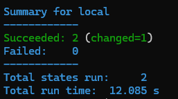
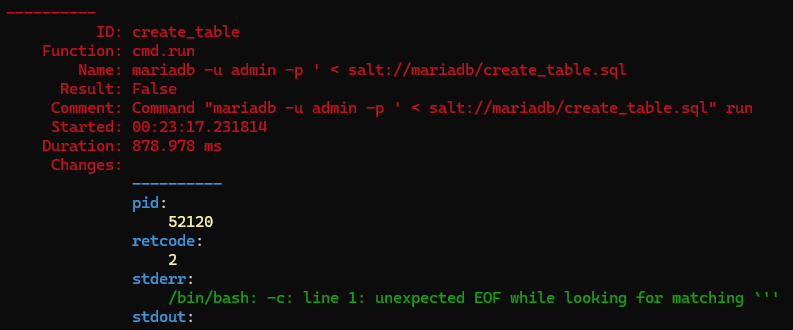
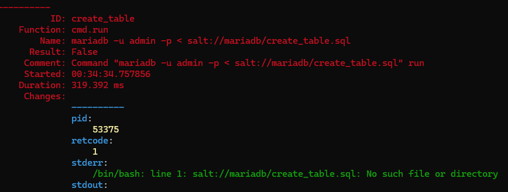
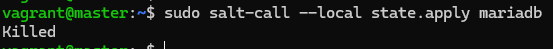
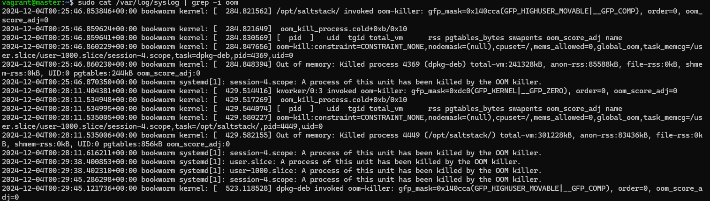

# H5 Loppuhuipennus

Tämän viikon tehtävissä tuli tehdä viime viikkona aloitettu projekti loppuun. Olin valinnut siis aiheekseni MariaDB-tietokannan hallinnan Salt-moduuleilla. Viime viikon tunnilla (28.11.2024) Tero Karviselta saamieni ohjeiden mukaan muutin lähestymistapaani, ja nyt Salt:in tarjoaman mysql-moduulin sijasta aion käyttää komentokehotetta tietokannan alustukseen. 

### Käyttöympäristö

Tietokone: Itse kasattu pöytätietokone

Emolevy: PRIME Z390-P

Prosessori: 3,70 GHz Intel Core i5-9600k

Keskusmuisti: 16 GB 3200MHz DDR4

Näytönohjain: Radeon RX 5600 XT Pulse 6GB GDDR6

Tallennustilat: C:/ 500 GB SSD M.2, D:/ 1000 GB SSD M.2

Käyttöjärjestelmä: Windows 11 Home 64-bit

## MariaDB

Käytin näiden tehtävien pohjana [tätä ohjetta](https://terokarvinen.com/2018/install-mariadb-on-ubuntu-18-04-database-management-system-the-new-mysql/?fromSearch=database).

### MariaDB:n asennus

Aloitin tehtävän luomalla MariaDB-moduulin ja sille tilatiedoston install_mariadb.sls

    $ sudo mkdir -p /srv/salt/mariadb/
    $ sudoedit /srv/salt/mariadb/install_mariadb.sls

Tilatiedoston sisältö: 

    mariadb-packages:
      pkg.installed:
        - pkgs:
          - mariadb-client
          - mariadb-server
        - refresh: True
    mariadb:
      service.running

  Tämän jälkeen loin init.sls-tiedoston johon asetin edellisen tilatiedoston suoritettavaksi.

      $ sudoedit /srv/salt/mariadb/init.sls

Init.sls-tiedoston sisältö:
  
    include:
      - mariadb.install_mariadb

Tämän jälkeen kokeilin moduulia paikallisesti. 

    $ sudo salt-call --local state.apply mariadb

Moduuli toivotusti. Kokeilin vielä ajaa moduulin uudestaan, jolloin muutoksia ei tapahtunut eli moduuli oli idempotentti.

### MariaDB:n konfigurointi

Seuraavaksi olisi tarkotus tehdä moduuli joka ensin asettaa MariaDB:n root-käyttäjän salasanan. Tämän jälkeen testitietokanta ja anonyymit käyttäjät poistetaan. Root-käyttäjällä luodaan uusi tietokanta sekä käyttäjä. Käyttäjälle annetaan oikeudet luotuun tietokantaan. Käyttäjän kirjatuminen automatisoidaan. Aloitin tekemällä tilatiedoston tietokannan konfigurontiin. Käytin [MySQL:n](https://dev.mysql.com/doc/refman/5.7/en/mysqladmin.html) ja [MariaDB_n](https://mariadb.com/kb/en/mysqladmin/) dokumentaatiota apuna root-käyttäjän salasanan vaihdossa.

    $ sudoedit /srv/salt/mariadb/configure_mariadb.sls

Tilatiedoston sisältö:

    
    
    
    set_root_password:
      cmd.run:
        - name: "mariadb-admin -u root password '{{ root_password }}'"
        - unless: "mariadb-admin -u root -e 'SELECT 1'"
    
    remove_test_database:
      cmd.run:
        - name: "mariadb -u root -p'{{ root_password }}' -e 'DROP DATABASE IF EXISTS test;'"
        - unless: "mariadb -u root -p'{{ root_password }}' -e 'SHOW DATABASES LIKE \"test\";'"
    
    remove_anonymous_users:
      cmd.run:
        - name: "mariadb -u root -p'{{ root_password }}' -e 'DELETE FROM mysql.user WHERE User=\"\";'"
        - unless: "mariadb -u root -p'{{ root_password }}' -e 'SELECT User FROM mysql.user WHERE User=\"\";'"
    
    create_database:
      cmd.run:
        - name: "mariadb -u root -p '{{ root_password }}' -e \"CREATE DATABASE IF NOT EXISTS watchlistdb\""
        - unless: "mariadb -u root -p'{{ root_password }}' -e 'SHOW DATABASES LIKE \"watchlistdb\";'"
    
    create_user:
     cmd.run:
        - name: "mariadb -u root -p'{{ root_password }}' -e \"CREATE USER IF NOT EXISTS 'admin'@'localhost' IDENTIFIED BY '{{ user_password }}';\""
        - unless: "mariadb -u root -p'{{ root_password }}' -e 'SELECT User FROM mysql.user WHERE User = 'admin';'"
    
    grant_priviledges:
      cmd.run:
        - name: "mariadb -u root -p'{{ root_password }}' -e \"GRANT ALL PRIVILEGES ON watchlistdb.* TO 'admin'@'localhost'; FLUSH PRIVILEGES;\""
        - require:
          - cmd: create_user
          - cmd: create_database
    
    create_table:
      cmd.run:
        - name: "mariadb -u admin -p '{{ user_password }} < salt://mariadb/create_table.sql"
        - unless: "mariadb -u admin -p '{{ user_password }}' -e \"SHOW TABLES LIKE 'watchlist';\" | grep -q 'watchlist'"

  Tämän jälkeen kävin lisäämässä init.sls-tiedostoon myös configure_mariadb.sls-tilatiedoston. Init.sls-tiedoston sisältö näytti nyt tältä:

    include:
      - mariadb.install_mariadb
      - mariadb.configure_mariadb

Tämän jälkeen kokeilin ajaa moduulin paikallisesti. 

    $ sudo salt-call --local state.apply mariadb

Sain kuvassa näkyvän virheen. Virheestä ilmeni selvästi, että komennossa on kirjoitusvirhe. Kävin korjaamassa kirjoitusvirheen ja kokeilin ajoa uudestaan. 

Tiedostoa ei löydetty, ja päättelin ettei sitä löydetä Salt:in kansioista cmd.run-komennossa. Siispä lisäsin tiedoston tallennuksen käyttäjän kansioon. Tämän jälkeen virtuaalikone sekosi täysin.

Moduulin ajamisen päättyi jatkuvasti prosessin tappamiseen. Tarkistin lokit, ja huomasin että sain jatkuvasti OOM-virheitä. Poistin koko virtuaalikoneen ja asetin Vagrantin asennustiedostoon enemmän muistia. Uusi virtuaalikone antoi myös samaa virhettä, jo heti alussa päivittäessäni paketteja. Viimeisenä oljenkortena kokeilin siirtyä slave-virtuaalikoneelle. Sillä pääsin moduulin suorittamiseen asti, mutta sen jälkeen tuli sama virhe yhä uudelleen. Virheet estävät moduulien suorittamisen, joten minun täytyy konsultoida kurssin opettajaa ennen, kuin voin jatkaa lopputyötä.

# Lähteet

Karvinen, T. 2018. Install MariaDB on Ubuntu 18.04 – Database Management System, the New MySQL. Tero Karvisen verkkosivusto. Luettavissa: [https://terokarvinen.com/2018/install-mariadb-on-ubuntu-18-04-database-management-system-the-new-mysql/?fromSearch=database](https://terokarvinen.com/2018/install-mariadb-on-ubuntu-18-04-database-management-system-the-new-mysql/?fromSearch=database). Luettu: 03.12.2024.

Karvinen, T. 28.11.2024. Opettaja. Haaga-Helia ammattikorkeakoulu. Suullinen tiedonanto. 

MariaDB. s.a. mysqladmin. MariaDB. Luettavissa: [https://mariadb.com/kb/en/mysqladmin/](https://mariadb.com/kb/en/mysqladmin/). Luettu: 3.12.2024.

Oracle. s.a. 4.5.2 mysqladmin — A MySQL Server Administration Program. MySQL. Luettavissa: [https://dev.mysql.com/doc/refman/5.7/en/mysqladmin.html](https://dev.mysql.com/doc/refman/5.7/en/mysqladmin.html). Luettu: 3.12.2024.

Salt Project. s.a. Pillar Walkthrough. Salt Project. Luettavissa: [https://docs.saltproject.io/en/3006/topics/tutorials/pillar.html](https://docs.saltproject.io/en/3006/topics/tutorials/pillar.html). Luettu: 3.12.2024.
