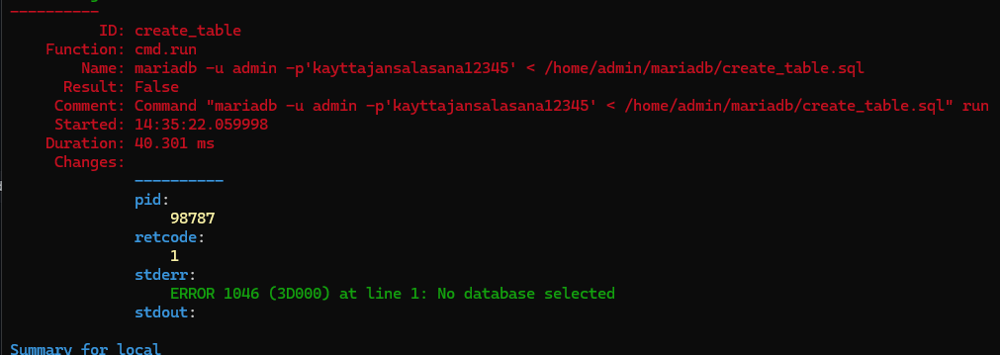
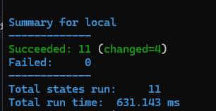
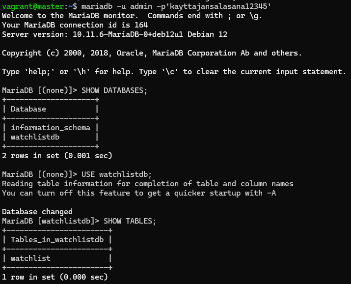
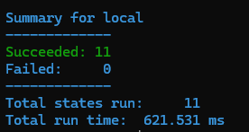
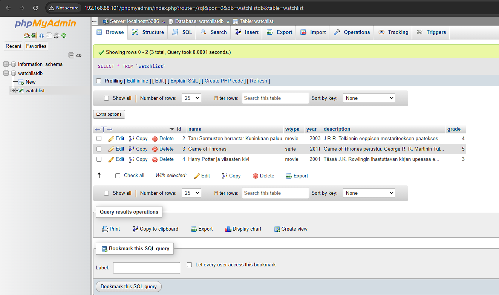
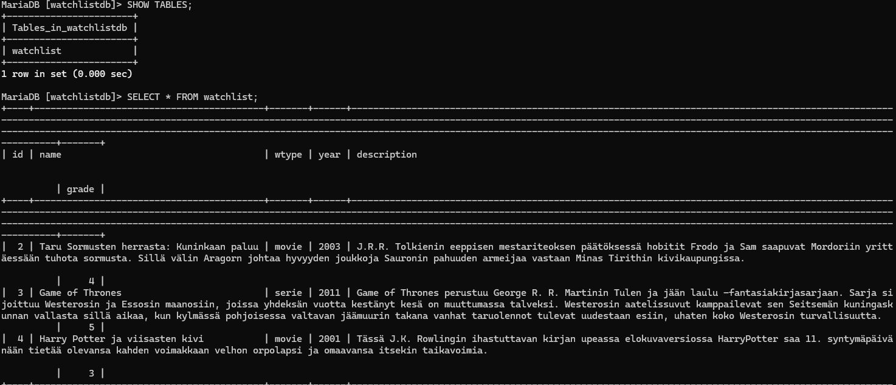
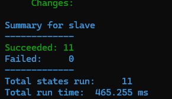
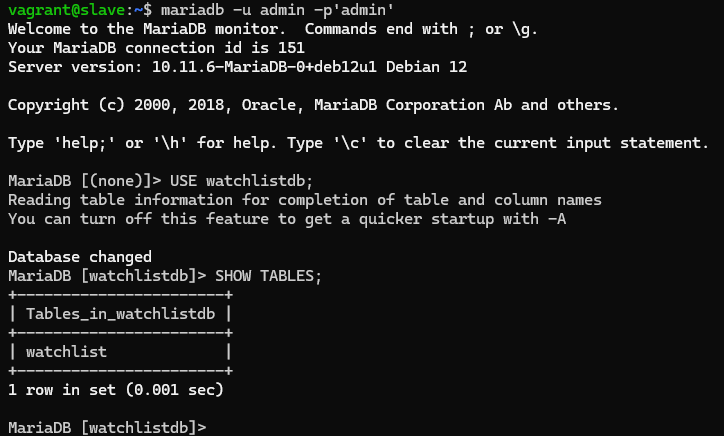
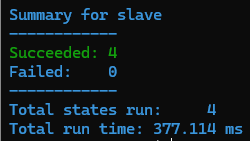
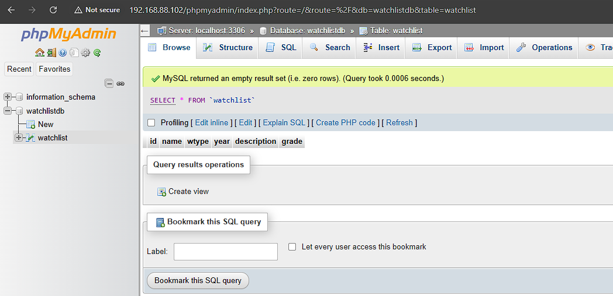

# H5 Loppuhuipennus

Tämän viikon tehtävissä tuli tehdä viime viikkona aloitettu projekti loppuun. Olin valinnut siis aiheekseni MariaDB-tietokannan hallinnan Salt-moduuleilla. Viime viikon tunnilla (28.11.2024) Tero Karviselta saamieni ohjeiden mukaan muutin lähestymistapaani, ja nyt Salt:in tarjoaman mysql-moduulin sijasta aion käyttää komentokehotetta tietokannan alustukseen. 

[Moduulin Github-repositorio](https://github.com/ilohil/watchlist-with-salt)

### Käyttöympäristö

Tietokone: Itse kasattu pöytätietokone

Emolevy: PRIME Z390-P

Prosessori: 3,70 GHz Intel Core i5-9600k

Keskusmuisti: 16 GB 3200MHz DDR4

Näytönohjain: Radeon RX 5600 XT Pulse 6GB GDDR6

Tallennustilat: C:/ 500 GB SSD M.2, D:/ 1000 GB SSD M.2

Käyttöjärjestelmä: Windows 11 Home 64-bit

## MariaDB

Käytin näiden tehtävien pohjana [tätä ohjetta](https://terokarvinen.com/2018/install-mariadb-on-ubuntu-18-04-database-management-system-the-new-mysql/?fromSearch=database).

### MariaDB:n asennus

Aloitin tehtävän luomalla MariaDB-moduulin ja sille tilatiedoston install_mariadb.sls

    $ sudo mkdir -p /srv/salt/mariadb/
    $ sudoedit /srv/salt/mariadb/install_mariadb.sls

Tilatiedoston sisältö: 

    mariadb-packages:
      pkg.installed:
        - pkgs:
          - mariadb-client
          - mariadb-server
        - refresh: True
    mariadb:
      service.running

  Tämän jälkeen loin init.sls-tiedoston johon asetin edellisen tilatiedoston suoritettavaksi.

      $ sudoedit /srv/salt/mariadb/init.sls

Init.sls-tiedoston sisältö:
  
    include:
      - mariadb.install_mariadb

Tämän jälkeen kokeilin moduulia paikallisesti. 

    $ sudo salt-call --local state.apply mariadb

Moduuli toivotusti. Kokeilin vielä ajaa moduulin uudestaan, jolloin muutoksia ei tapahtunut eli moduuli oli idempotentti.

### MariaDB:n konfigurointi

Seuraavaksi olisi tarkotus tehdä moduuli joka ensin asettaa MariaDB:n root-käyttäjän salasanan. Tämän jälkeen testitietokanta ja anonyymit käyttäjät poistetaan. Root-käyttäjällä luodaan uusi tietokanta sekä käyttäjä. Käyttäjälle annetaan oikeudet luotuun tietokantaan. Käyttäjän kirjatuminen automatisoidaan. Aloitin tekemällä tilatiedoston tietokannan konfigurontiin. Käytin [MySQL:n](https://dev.mysql.com/doc/refman/5.7/en/mysqladmin.html) ja [MariaDB_n](https://mariadb.com/kb/en/mysqladmin/) dokumentaatiota apuna root-käyttäjän salasanan vaihdossa.

    $ sudoedit /srv/salt/mariadb/configure_mariadb.sls

Tilatiedoston sisältö:

    
    
    
    set_root_password:
      cmd.run:
        - name: "mariadb-admin -u root password '{{ root_password }}'"
        - unless: "mariadb-admin -u root -e 'SELECT 1'"
    
    remove_anonymous_users:
      cmd.run:
        - name: "mariadb -u root -p'{{ root_password }}' -e 'DELETE FROM mysql.user WHERE User=\"\";'"
        - unless: "mariadb -u root -p'{{ root_password }}' -e 'SELECT User FROM mysql.user WHERE User=\"\";'"
    
    create_database:
      cmd.run:
        - name: "mariadb -u root -p '{{ root_password }}' -e \"CREATE DATABASE IF NOT EXISTS watchlistdb\""
        - unless: "mariadb -u root -p'{{ root_password }}' -e 'SHOW DATABASES LIKE \"watchlistdb\";'"
    
    create_user:
     cmd.run:
        - name: "mariadb -u root -p'{{ root_password }}' -e \"CREATE USER IF NOT EXISTS 'admin'@'localhost' IDENTIFIED BY '{{ user_password }}';\""
        - unless: "mariadb -u root -p'{{ root_password }}' -e 'SELECT User FROM mysql.user WHERE User = 'admin';'"
    
    grant_priviledges:
      cmd.run:
        - name: "mariadb -u root -p'{{ root_password }}' -e \"GRANT ALL PRIVILEGES ON watchlistdb.* TO 'admin'@'localhost'; FLUSH PRIVILEGES;\""
        - require:
          - cmd: create_user
          - cmd: create_database
    
    create_table:
      cmd.run:
        - name: "mariadb -u admin -p '{{ user_password }} < salt://mariadb/create_table.sql"
        - unless: "mariadb -u admin -p '{{ user_password }}' -e \"SHOW TABLES LIKE 'watchlist';\" | grep -q 'watchlist'"

  Tämän jälkeen kävin lisäämässä init.sls-tiedostoon myös configure_mariadb.sls-tilatiedoston. Init.sls-tiedoston sisältö näytti nyt tältä:

    include:
      - mariadb.install_mariadb
      - mariadb.configure_mariadb

Tämän jälkeen kokeilin ajaa moduulin paikallisesti. 

    $ sudo salt-call --local state.apply mariadb

Sain kuvassa näkyvän virheen. Virheestä ilmeni selvästi, että komennossa on kirjoitusvirhe. Kävin korjaamassa kirjoitusvirheen ja kokeilin ajoa uudestaan. 

Tiedostoa ei löydetty, ja päättelin ettei sitä löydetä Salt:in kansioista cmd.run-komennossa. Siispä lisäsin tiedoston tallennuksen käyttäjän kansioon. Tämän jälkeen virtuaalikone sekosi täysin.

Moduulin ajamisen päättyi jatkuvasti prosessin tappamiseen. Tarkistin lokit, ja huomasin että sain jatkuvasti OOM-virheitä. Poistin koko virtuaalikoneen ja aloitin uudelleen. Uusi virtuaalikone antoi myös samaa virhettä, jo heti alussa päivittäessäni paketteja. Viimeisenä oljenkortena kokeilin siirtyä slave-virtuaalikoneelle. Sillä pääsin moduulin suorittamiseen asti, mutta sen jälkeen tuli sama virhe yhä uudelleen. Virheet estävät moduulien suorittamisen, joten minun täytyy konsultoida kurssin opettajaa ennen, kuin voin jatkaa lopputyötä.

Sain opettajalta vinkin katsoa [tätä sivua](https://developer.hashicorp.com/vagrant/docs/providers/virtualbox/configuration#vboxmanage-customizations) Vagrantin asennustiedoston konfigurointiin. Lisäsin asennustiedostoon seuraavan rivin:

    config.vm.provider "virtualbox" do |v|
        v.memory = 2048
      end

Seuraavaksi poistin virtuaalikoneet ja alustin ne uudestaan. Nyt virtuaalikoneet toimivat. Jatkoin mihin jäin, eli muokkasin configure_mariadb.sls-tilatiedostoa.

    
    
    
    admin:
      user.present
    
    set_root_password:
      cmd.run:
        - name: mariadb -u root -e "SET PASSWORD FOR 'root'@'localhost' = PASSWORD('{{ root_password }}')"
        - unless: mariadb -u root -p'{{ root_password }}' -e "SELECT User FROM mysql.user WHERE User='root';" | grep -i "root"
    
    remove_test_database:
      cmd.run:
        - name: mariadb -u root -p'{{ root_password }}' -e "DROP DATABASE IF EXISTS test;"
        - onlyif: mariadb -u root -p'{{ root_password }}' -e "SHOW DATABASES LIKE 'test'" | grep -q '^test$'
    
    create_user:
      cmd.run:
        - name: mariadb -u root -p'{{ root_password }}' -e "CREATE USER 'admin'@'localhost' IDENTIFIED BY '{{ user_password }}';"
        - unless: mariadb -u root -p'{{ root_password }}' -e "SELECT User FROM mysql.user WHERE User='admin';" | grep -i "admin"
    
    create_database:
      cmd.run:
        - name: mariadb -u root -p'{{ root_password }}' -e "CREATE DATABASE IF NOT EXISTS watchlistdb"
        - unless: mariadb -u root -p'{{ root_password }}' -e "SHOW DATABASES LIKE 'watchlistdb';" | grep -i "watchlistdb"
    
    grant_priviledges:
      cmd.run:
        - name: mariadb -u root -p'{{ root_password }}' -e "GRANT ALL PRIVILEGES ON watchlistdb.* TO 'admin'@'localhost'; FLUSH PRIVILEGES;"
        - unless: mariadb -u root -p'{{ root_password }}' -e "SHOW GRANTS FOR 'admin'@'localhost'" | grep -i "watchlistdb"
    
    /home/admin/mariadb:
      file.directory:
        - user: admin
        - group: admin
    
    /home/admin/mariadb/create_table.sql:
      file.managed:
        - source: salt://mariadb/create_table.sql
        - user: admin
        - group: admin
    
    create_table:
      cmd.run:
        - name: mariadb -u admin -p'{{ user_password }}' < /home/admin/mariadb/create_table.sql
        - unless: mariadb -u admin -p'{{ user_password }}' watchlistdb -e "SHOW TABLES LIKE 'watchlist'" | grep -q 'watchlist'

Tiedoston sisältö muuttui siis siten, että lisäsin admin-käyttäjän ja sekä tallensin SQL-lauseen käyttäjän hakemistoon. Lisäksi korjasin paljon väärää syntaksia ja vaihdoin rootin salasanan asettamisen [tämän dokumentaation](https://mariadb.com/kb/en/set-password/#syntax) mukaisesti.  Ajoin taas moduulin paikallisesti.

Muut moduulin osat toimivat, mutta sain virheen, että taululle ei oltu asetettu tietokantaa johon sen tulisi tallentua. Kävin siis lisäämässä create_table.sql-tiedoston alkuun käytettävän tietokannan ja kokeilin taas ajaa moduulin paikallisesti. 

Moduulin ajo onnistui. Kävin vielä tarkistamassa, että tietokanta on muuttunut. 

Watchlistdb-tietokanta oli ilmestynyt ja sille oli luotu taulu watchlist. Lisäksi käyttäjä oli luotu, sillä pystyin kirjautumaan sen tunnuksilla sisään. Viimeisenä tarkistin vielä, että moduuli on idempotentti ajamalla sen uudelleen.

Muutoksia ei tapahtunut, joten ehdot toimivat oikein ja moduuli oli idempotentti.

## phpMyAdmin

Jatkoin tehtävää 11.12 tehdäkseni vielä yksinkertaisen käyttöliittymän tietokannalle. Tutkaillessani vaihtoehtoja päädyin käyttämään [phpMyAdmin](https://www.phpmyadmin.net/)-palvelua, joka luo automaattisesti käyttöliittymän MYSQL- ja MariaDB tietokannoille. Sovelsin [näitä ohjeita](https://www.digitalocean.com/community/tutorials/how-to-install-phpmyadmin-from-source-debian-10) tehtävässä. Aloitin luomalla käyttöliittymälle oman moduulin:

    $ sudo mkdir -p /srv/salt/phpmyadmin/

Tämän jälkeen tein moduuliin install_phpmyadmin.sls-tiedoston.

    $ sudoedit /srv/salt/phpmyadmin/install_phpmyadmin.sls

Tiedoston sisältö:

    install_phpmyadmin:
      pkg.installed:
        - pkgs:
          - phpmyadmin
          - apache2
          - php
          - php-mysql

Tämän jälkeen loin moduuliin init.sls tiedoston, johon lisäsin install_phpmyadmin-tiedoston suoritettavaksi. 

    $ sudoedit /srv/salt/phpmyadmin/init.sls

Tiedoston sisältö:

    include:
      - phpmyadmin.install_phpmyadmin

Tämän jälkeen testasin paikallisesti, että tarvittavat asennukset onnistuvat.

    $ sudo salt-call --local state.apply phpmyadmin

Asennukset onnistuivat ja moduuli oli idempotentti. Seuraavaksi kopioin phpmyadminin konfiguraation Apachelle moduulin kansioon ja nimesin sen uudelleen.

    $ sudo cp /etc/phpmyadmin/apache.conf /srv/salt/phpmyadmin/phpmyadmin.conf

Tämän jälkeen aloin luomaan tilatiedostoa konfiguraation tallentamiselle hakemistoon ja käyttöönottamiseen Apachessa.

    $ sudoedit /srv/salt/phpmyadmin/configure_phpmyadmin.sls

Tiedoston sisältö: 

    /etc/apache2/conf-available/phpmyadmin.conf:
      file.managed:
        - source: salt://phpmyadmin/phpmyadmin.conf
    
    a2enconf phpmyadmin.conf:
      cmd.run:
        - unless: test -L /etc/apache2/conf-enabled/phpmyadmin.conf
    
    apache2service:
      service.running:
        - name: apache2
        - watch:
          - file: /etc/apache2/conf-available/phpmyadmin.conf
          - cmd: a2enconf phpmyadmin.conf

Tämän jälkeen lisäsin myös luodun tilatiedoston init.sls-tiedostoon. Viimeisenä vielä testasin luotua moduulia paikallisesti.

    $ sudo salt-call --local state.apply phpmyadmin

Ajo onnistui ensiyrittämällä ja moduuli oli idempotentti. Testasin mennä master-virtuaalikoneen IP-osoitteeseen pöytäkoneeni selaimella nähdäkseni toimiiko käyttöliittymä.

Kokeilin muutamia toimintoja, kuten lisätä, muokata sekä poistaa tietoa käyttöliittymässä. Käyttöliittymä näytti toimivan hienosti. Viimeisenä kävin vielä komentokehotteen kautta kurkkaamassa ovatko tiedot päivittyneet tietokantaan.

Vaikka tieto näkyi hieman sekavasti komentokehotteessa, pystyi siitä päättelemään että lisätyt tiedot olivat myös oikeasti tallentuneet tietokantaan. Nyt olin tyytyväinen projektini lopputulokseen.

## Moduulien ajo minionilla

Loppuhuipennuksena kokeilin ajaa tekemiäni moduuleita minionilla. Ensin ajoin mariadb-moduulin.

    $ sudo salt '*' state.apply mariadb

Ajo onnistui ja moduuli oli idempotentti. Kävin vielä tarkistamassa tietokannan.

Pääsin kirjautumaan slave-virtuaalikoneella tietokantaan ja watchlistdb oli ilmestynyt. Seuraavaksi ajoin vielä phpmyadmin-moduulin.

    $ sudo salt '*' state.apply phpmyadmin

Myös tämän myphpadmin-moduulin ajo onnistui ja se oli idempotentti. Viimeiseksi vielä tarkistin slave-virtuaalikoneen localhostin, että käyttöliittymä näkyy siellä. 

PhpMyAdmin-käyttöliittymä näkyi myös slave-virtuaalikoneen IP-osoitteessa. Nyt siis moduulit oli testattu myös minion-tietokoneella.

# Lähteet

Drake, M. 16.10.2020. How To Install phpMyAdmin From Source on Debian 10. DigitalOcean. Luettavissa: [https://www.digitalocean.com/community/tutorials/how-to-install-phpmyadmin-from-source-debian-10](https://www.digitalocean.com/community/tutorials/how-to-install-phpmyadmin-from-source-debian-10). Luettu: 12.12.2024.

Karvinen, T. 2018. Install MariaDB on Ubuntu 18.04 – Database Management System, the New MySQL. Tero Karvisen verkkosivusto. Luettavissa: [https://terokarvinen.com/2018/install-mariadb-on-ubuntu-18-04-database-management-system-the-new-mysql/?fromSearch=database](https://terokarvinen.com/2018/install-mariadb-on-ubuntu-18-04-database-management-system-the-new-mysql/?fromSearch=database). Luettu: 03.12.2024.

Karvinen, T. 28.11.2024. Opettaja. Haaga-Helia ammattikorkeakoulu. Suullinen tiedonanto. 

MariaDB. s.a. mysqladmin. MariaDB. Luettavissa: [https://mariadb.com/kb/en/mysqladmin/](https://mariadb.com/kb/en/mysqladmin/). Luettu: 3.12.2024.

MariaDB. s.a. SET PASSWORD. MariaDB. Luettavissa: [https://mariadb.com/kb/en/set-password/#syntax](https://mariadb.com/kb/en/set-password/#syntax). Luettu: 3.12.2024.

Oracle. s.a. 4.5.2 mysqladmin — A MySQL Server Administration Program. MySQL. Luettavissa: [https://dev.mysql.com/doc/refman/5.7/en/mysqladmin.html](https://dev.mysql.com/doc/refman/5.7/en/mysqladmin.html). Luettu: 3.12.2024.

phpMyAdmin contributors. s.a. Bringing MySQL to the web. phpMyAdmin. Luettavissa: [https://www.phpmyadmin.net/](https://www.phpmyadmin.net/). Luettu: 11.12.2024.

Salt Project. s.a. Pillar Walkthrough. Salt Project. Luettavissa: [https://docs.saltproject.io/en/3006/topics/tutorials/pillar.html](https://docs.saltproject.io/en/3006/topics/tutorials/pillar.html). Luettu: 3.12.2024.
